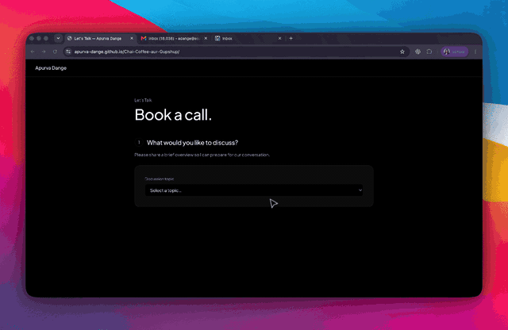

# Chai, Coffee aur Gupshup

A personal scheduling experience built for effortless coffee-chat bookings—without relying on a third-party scheduling platform.

**[Book a coffee chat →](https://apurva-dange.github.io/Chai-Coffee-aur-Gupshup/)**

## Project Demo



## Highlights

- Live availability synced with Google Calendar
- 15-minute and 45-minute meeting options
- Automatic Google Meet links and calendar invitations
- Double-booking protection with configurable buffers and notice periods
- Responsive, focused booking flow hosted on GitHub Pages

## How it works

The React frontend collects the meeting details and displays available time slots. A Google Apps Script service securely checks calendar availability, creates the event, adds a Google Meet link, and sends the invitation—without exposing Google credentials to the browser.

### Workflows covered

| User action or trigger | What the project calls | Outcome |
| --- | --- | --- |
| Select a discussion topic | React updates the booking state; choosing **Other** reveals an optional notes field | Captures the purpose and context of the conversation |
| Select **15 min** or **45 min** | `getAvailability()` sends an availability request to the Apps Script `doGet()` endpoint | Starts loading valid dates and times for the selected duration |
| Load or change a month | Apps Script calls Google Calendar API v3 through `Calendar.Freebusy.query()` | Returns open slots after applying working hours, 24-hour notice, date range, and 15-minute buffers |
| Select a date and time | React filters the returned slots locally | Displays only available times and prepares the selected Phoenix-time timestamp |
| Click **Confirm booking** | `createBooking()` submits the details to Apps Script `doPost()` | Validates the form, runs the bot-check, locks the booking operation, and checks the slot again to prevent double-booking |
| Slot passes the final check | Apps Script calls `Calendar.Events.insert()` with conference creation enabled | Creates **Coffee Chat with Apurva**, generates a Google Meet link, and emails the calendar invitation to the guest |
| Booking completes | Apps Script returns the result with `postMessage()` | React displays the confirmed time, duration, email, and Meet link |
| Changes are pushed to `main` | GitHub Actions runs install, tests, build, and GitHub Pages deployment | Publishes the latest frontend automatically |

## Built with

React · TypeScript · Vite · Google Apps Script · Google Calendar API · GitHub Pages

## Run locally

```bash
cp .env.example .env.local
npm install
npm run dev
```

## Availability

Times are shown in Phoenix time (MST): weekdays from 8 AM–7 PM and weekends from 10 AM–4 PM, with a 24-hour minimum notice.
