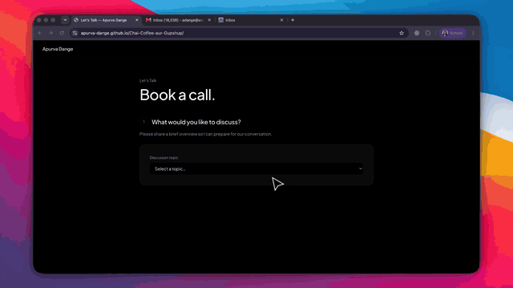

# Chai, Coffee aur Gupshup

A personal scheduling experience built for effortless coffee-chat bookings—without relying on a third-party scheduling platform.

**[Book a coffee chat →](https://apurva-dange.github.io/Chai-Coffee-aur-Gupshup/)**

## Project Demo

### Version 1



### Version 2


## Highlights

- Live availability synced with Google Calendar
- 15- and 45-minute meeting options
- Automatic Google Meet links and calendar invitations
- Double-booking protection with configurable buffers and notice periods
- Responsive, focused booking flow hosted on GitHub Pages

## How it works

The React frontend collects the meeting details and displays available time slots. A Google Apps Script service securely checks calendar availability, creates the event, adds a Google Meet link, and sends the invitation—without exposing Google credentials to the browser.

## Built with

React · TypeScript · Vite · Google Apps Script · Google Calendar API · GitHub Pages

## Run locally

```bash
cp .env.example .env.local
npm install
npm run dev
```

## Availability

Times are shown in Phoenix time (MST): weekdays from 8 AM–7 PM and weekends from 10 AM–4 PM, with a 24-hour minimum notice.
